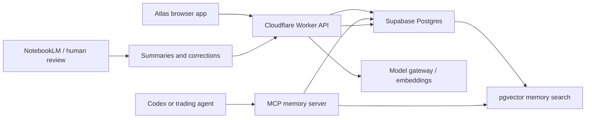

# Atlas Open Brain Plan

This is the working design for giving Atlas a persistent trading memory that agents can read through MCP and improve through the Karpathy loop.

## Goal

Atlas should remember trader actions, advisory inputs, second opinions, paper trade outcomes, feature requests, and lessons learned. Future agents should retrieve similar historical situations before producing an advisory, so the system improves from actual use instead of starting cold each session.

## Source Pattern

The Open Brain / OB1 pattern is a strong fit because it separates memory storage, vector search, and agent access:

- PostgreSQL with `pgvector` stores durable memories and embeddings.
- A model gateway creates embeddings and optionally handles model calls.
- An MCP server exposes memory tools to agents.
- A dashboard lets humans inspect, prune, and correct memory.

For Atlas, the memory system should be attached to the paper trading and advisory workflow, not treated as a separate chat notebook.

## Architecture



## Memory Records

Each event should keep raw text, structured metadata, and an embedding.

```json
{
  "id": "memory-...",
  "time": "2026-05-01T18:43:00.000Z",
  "type": "paper-trade",
  "summary": "BUY NOL-18MAY26-CDE at $102.15 with 54 conviction",
  "raw": {
    "commodity": "oil",
    "contract": "NOL-18MAY26-CDE",
    "side": "long",
    "model": "gpt-5-5",
    "conviction": 54,
    "entry": 102.15,
    "target": 103.17,
    "stop": 101.34,
    "outcome": null
  },
  "tags": ["oil", "paper-trade", "long", "gpt-5-5"]
}
```

## What To Store

- Advisory snapshots: model, commodity, price, conviction, tone, target, stop, reasons.
- Trader actions: manual overrides, model changes, second-opinion runs, sandbox toggles.
- Paper trades: open, close, step, capital committed, fees, gross/net P/L, time open.
- Outcomes: target hit, stop hit, missed exit, stale quote, model disagreement.
- Feature requests and bug reports: product feedback becomes agent memory too.
- Daily summaries: win rate, average P/L, worst setup, best setup, threshold changes.

## MCP Tools

The memory server should expose a small, stable tool surface:

- `atlas_memory.capture(event)`: store a structured memory event.
- `atlas_memory.search(query, filters)`: semantic search by setup, model, commodity, or date.
- `atlas_memory.recent(filters)`: retrieve recent trader actions.
- `atlas_memory.performance(filters)`: summarize win rate, P/L, and model accuracy.
- `atlas_memory.lesson(tradeId)`: write a human-approved lesson back to memory.

## Karpathy Loop Integration

1. Collect: save advisory snapshots and trade outcomes.
2. Evaluate: calculate accuracy by horizon, commodity, model, and threshold.
3. Diagnose: retrieve losing setups and find recurring failure patterns.
4. Adjust: suggest threshold, stop distance, prompt, or model-routing changes.
5. Validate: compare new rules against retained history before turning them on.

The agent should not change live trading rules automatically. It should propose changes and store the reasoning for review.

## NotebookLM Role

NotebookLM can be useful as a review and summarization layer, not as the primary database. Export daily or weekly memory packs from Atlas, load them into NotebookLM, and use it to produce human-readable lessons. Approved lessons can be written back to the Open Brain store.

## Implementation Phases

1. Local event capture: started in the Atlas app with the Open Brain panel.
2. Worker endpoints: add `/memory` GET/POST to Cloudflare Worker.
3. Supabase store: create `atlas_memories` table with `pgvector`.
4. Embeddings: add embedding generation through a server-side model gateway.
5. MCP server: expose search/capture/performance tools to Codex and other agents.
6. Learning loop: connect memory retrieval to advisory prompts and second opinions.

## Safety Rules

- Do not store API keys, passwords, auth codes, or brokerage credentials in memory.
- Keep live order execution separate from advisory memory.
- Treat memory retrieval as context, not as trading authority.
- Require human review before deploying rule or model changes that affect trades.
